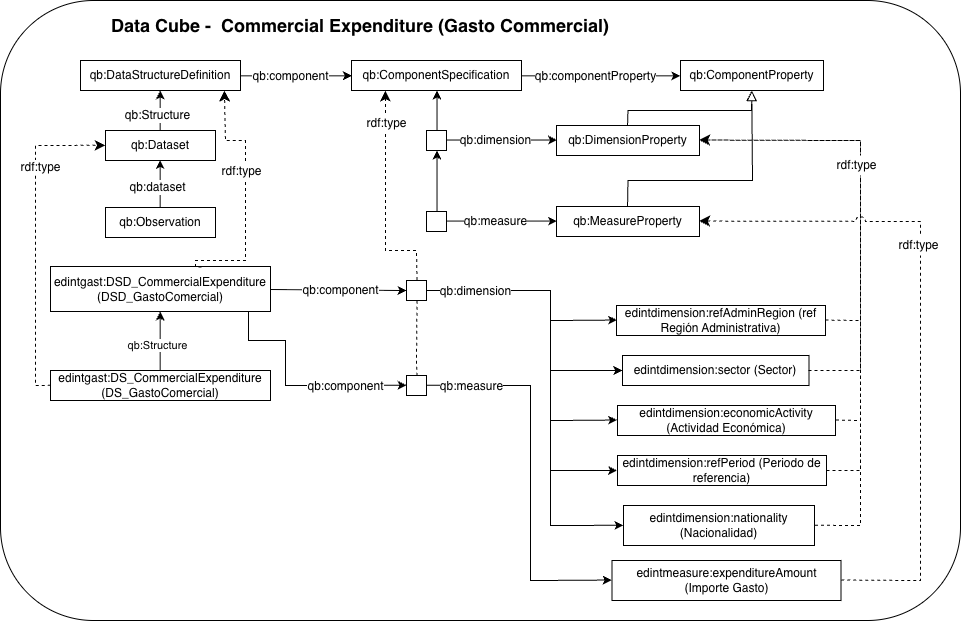

# Cubo de datos EDINT de gasto comercial (EDINT Commercial Expenditure Data Cube)

Este recurso define un **cubo de datos RDF** para representar información agregada sobre **gasto comercial** en función de distintas dimensiones de análisis, como la región administrativa, el periodo temporal, el sector, la actividad económica y la nacionalidad. El modelo se ha desarrollado siguiendo el vocabulario **RDF Data Cube**, lo que permite estructurar la información de forma interoperable, reutilizable y preparada para su consulta mediante SPARQL.

Este cubo de datos está siendo desarrollado en el contexto del Espacio de Datos para las Infraestructuras Urbanas Inteligentes ([EDINT](https://edint.es/)).

# Propósito y alcance del cubo de datos (Purpose and scope of the data cube)

El cubo de datos de gasto comercial proporciona un modelo semántico para describir observaciones estadísticas relacionadas con el gasto realizado en contextos comerciales. Cada observación combina un conjunto de dimensiones, área administrativa, tiempo, sector, actividad económica y nacionalidad, junto con una medida numérica que representa el **importe del gasto**.

El vocabulario reutiliza y extiende términos procedentes de estándares y recursos como  **[RDF Data Cube](https://www.w3.org/TR/vocab-data-cube/)**, **[SDMX](https://sdmx.org/)**, **[Time Ontology](https://www.w3.org/TR/owl-time/)**, clasificaciones SKOS y vocabularios de administración pública, con el objetivo de favorecer la interoperabilidad con otros conjuntos de datos y modelos estadísticos.

El alcance de este cubo se centra en la representación de **observaciones agregadas de gasto comercial** . El modelo permite describir el gasto a partir de las siguientes dimensiones:

* **región administrativa de referencia** , como municipio, barrio o distrito;
* **periodo de referencia** , modelado como intervalo temporal;
* **sector** ;
* **actividad económica** , representada mediante clasificaciones controladas CNAE;
* **nacionalidad** de los sujetos de la estadística.

La medida principal incluida en el cubo es el **importe del gasto comercial** , expresado como valor numérico.

# Prefijo y espacio de nombres (Prefix and namespace)

El prefijo del cubo de datos es: edintgast y se encuentra publicada en el espacio de nombres: **[http://vocab.linkeddata.es/datosabiertos/def/comercio/cubo-gasto-comercial#]()**

Las dimensiones se representan con el prefijo **edintdimension** y se encuentra en el espacio de nombres: **[http://vocab.linkeddata.es/datosabiertos/def/dimension#](http://vocab.linkeddata.es/datosabiertos/def/dimension#)**

Las medidas se representan con el prefijo **edintmeasure** y se encuentre en el espacio de nombres: **[http://vocab.linkeddata.es/datosabiertos/def/measure#](http://vocab.linkeddata.es/datosabiertos/def/measure#)**

# Modelo conceptual (Data Cube conceptualization)

# Estructura del repositorio (Repository structure)

El repositorio debe contener (al menos) las siguientes carpetas

| Carpeta                  | Descripción                                                                                                                                        |
| ------------------------ | --------------------------------------------------------------------------------------------------------------------------------------------------- |
| **diagrams/**      | Contiene diagramas y otros recursos que representan el modelo conceptual del cubo de datos (por ejemplo, las dimensiones y las medidas).           |
| **documentation/** | Contiene la documentación del cubo de datos y artefactos relacionados en formato HTML o dirigida a usuarios.                                       |
| **kos/**           | Contiene la implementación de vocabularios controlados o KOS, generalmente implementaciones SKOS en RDF.                                           |
| **ontology/**      | Contiene los archivos de implementación del cubo de datos en formatos como .owl .                                                                  |
| **requirements/**  | Contiene todos los documentos utilizados para definir los requisitos del cubo de datos: preguntas de competencia y sus respectivas SPARQL queries. |

# Mantenimiento y evolución (Maintenance and evolution)

Para manejar las incidencias o mejoras sugeridas con respecto al cubo de datos, recomendamos seguir las guías proporcionadas en ([Issues Management](./ISSUES.md)) para generar una incidencia.

# Financiación (Funding)

Este cubo de datos ha sido desarrollado en el contexto del Espacio de Datos para las Infraestructuras Urbanas Inteligentes ([EDINT](https://edint.es)).

